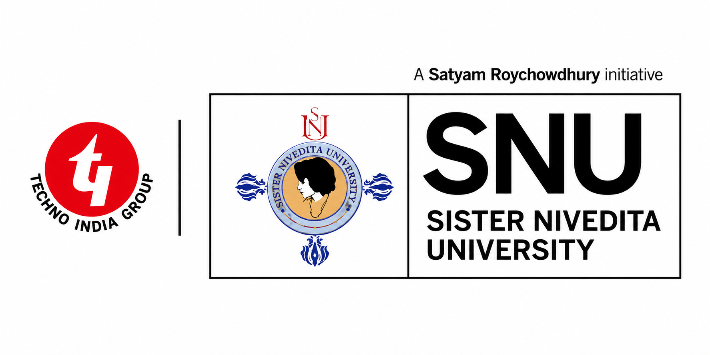

# 

<div align="center">



### 🎓 B.Tech CSE (AI & ML) · Sister Nivedita University, Kolkata
### 🤖 Future AI Engineer · Web Developer · Hackathon Builder · Tech Explorer


<p>
<a href="https://github.com/visionary-code-studio">
  
</a>
<a href="https://linkedin.com/in/vaibhav-shaw-55124835b">
  
</a>
<a href="https://vaibhavportfolio26.netlify.app">
  
</a>
<a href="mailto:vaibhavsnu2025@gmail.com">
  
</a>
</p>

📍 Kolkata, West Bengal, India &nbsp;&nbsp;|&nbsp;&nbsp; 📧 vaibhavshawsnu.btech.cse.aiml@gmail.com


</div>

---

## 💫 About Me

I am **Vaibhav Shaw**, a passionate Computer Science undergraduate pursuing **B.Tech in CSE (Artificial Intelligence & Machine Learning)** at **Sister Nivedita University, Kolkata**.

I thrive at the intersection of intelligence and engineering — building systems that think, adapt, and solve real-world problems. My work spans AI/ML research, full-stack web development, and hackathon prototyping, where I've delivered enterprise-grade solutions under tight deadlines.

> *"I embrace life with curiosity, create with purpose, innovate with passion, and never stop learning."*

---

## 🎓 Education

<table>
<tr>
<td width="60%">

### 🏛 Sister Nivedita University, Kolkata
**B.Tech — Computer Science Engineering (AI & ML)**
📅 2025 – 2029 (Expected)
⭐ CGPA (1st Semester): **9.43 / 10**

</td>
<td align="center">

</td>
</tr>
</table>

### 🏫 School Background

| Qualification | Board | Institution | Year | Score |
|:---|:---|:---|:---:|:---:|
| Class XII | CBSE | Bholananda National Vidyalaya, Barrackpore | 2025 | **75.83%** |
| Class X | CBSE | Bholananda National Vidyalaya, Barrackpore | 2023 | **85.50%** |

---

## 🚀 What I'm Currently Working On

```text
🤖  Artificial Intelligence & Machine Learning
🌐  Full Stack Web Development  
⚡  Git & GitHub / Version Control
☁   Firebase & Cloud Services
📊  Data Structures & Algorithms
🏆  National Hackathon Preparation
🔬  Physics-Informed Machine Learning (PIML)
⚛   Quantum Computing Fundamentals
🎨  UI/UX Design & Prototyping
🧱  Software Architecture & System Design
```

---

## 💻 Technical Skills

### 🖥 Programming Languages

<p>


</p>

`C` &nbsp; `C++` &nbsp; `Python` &nbsp; `Java (Basic)`

---

### 🌐 Web Development

<p>


</p>

`HTML5` &nbsp; `CSS3` &nbsp; `JavaScript` &nbsp; `Responsive Design` &nbsp; `Interactive UI`

---

### 🛠 Tools & Platforms

<p>


</p>

`Git` &nbsp; `GitHub` &nbsp; `VS Code` &nbsp; `Firebase` &nbsp; `Firebase Studio` &nbsp; `Figma` &nbsp; `Sublime Text`

---

### 🎨 Design & Creative Tools

`Canva` &nbsp; `Framer` &nbsp; `Figma` &nbsp; `MS Office` &nbsp; `Graphic Design`

---

### ⚡ Vibe Coding

One of my signature development approaches — blending intuitive design sense with rapid prototyping to build **high-fidelity, enterprise-grade interfaces** at hackathon speed.

- 🏗 Built full multi-portal hackathon platforms as single-file HTML prototypes
- 🎯 Delivered complete UI systems (dashboards, auth flows, role-based portals) solo
- 🌐 Used **Three.js**, animated backgrounds, real-time simulated data feeds
- 🔗 Integrated conceptual systems: Blockchain, AI evaluation, NFT certificates
- 💡 Bridged ideation → polished prototype in hours, not weeks

---

## 🌱 Fields of Interest

```text
🤖  Artificial Intelligence
🧠  Machine Learning & Deep Learning
🌐  Full Stack Web Development
🔬  Physics-Informed Machine Learning (PIML)
⚛   Quantum Computing
🔐  Cybersecurity & AI-Driven Security Systems
⛓  Blockchain & Decentralized Applications
🎮  Game Development & Intelligent Gaming Systems
☁   Cloud Technologies & DevOps
🎨  UI/UX Design & Human-Computer Interaction
📐  Software Engineering & Architecture
🔓  Open Source Contribution
📊  Data Science & Analytics
🖼  Graphic Designing
📖  Research & Innovation
```

---

## 🏆 Hackathons & Achievements

| Event | Domain | Status |
|:---|:---|:---:|
| **VIT Mauritius Hackathon** | Technology & Innovation | 🥇 Participant |
| **Smart India Hackathon (SIH)** | National Level | 🥇 Participant |
| **Hackfinix 2026** — *SentinelX* | AI Cybersecurity Platform | 🏗 Builder |
| **IntelliExaChain Hackathon** | Blockchain + AI Exam Integrity | 🏗 Builder |
| **Indian Case Challenge** | Business & Strategy | 🥇 Participant |
| **Code Clash** | Competitive Coding | 🥇 Participant |
| **Skepsis C Quest** | C Programming Contest | 🥇 Participant |

---

## 🛠 Projects

### 🔐 SentinelX — AI-Powered Industrial Cybersecurity Platform
> *Hackfinix 2026 · Cambridge Institute of Technology NC, Bengaluru*

A professional-grade cybersecurity dashboard for OT/ICS environments, built as a fully functional single-file HTML prototype.

**Highlights:**
- 🌍 **3D Three.js animated globe** with real-time threat visualization
- 🔎 OT/ICS domain coverage: Modbus, DNP3, SCADA, MITRE ATT&CK for ICS
- 🔐 Full authentication flow with role-based dashboard routing
- 📊 Live simulated threat intelligence feeds and incident timelines
- 💻 Zero dependencies — one self-contained HTML file

---

### ⛓ IntelliExaChain — Blockchain-Backed AI Examination Integrity Platform

A comprehensive examination integrity ecosystem with six role-based portals and eight functional modules.

**Highlights:**
- 🧠 **Hybrid AI + Professor + Blockchain** evaluation workflow
- 🏅 **NFT-based digital certificates** for verified academic credentials
- 🎥 Video background landing page + full portal routing
- 👥 Roles: Student, Professor, Admin, Examiner, Verifier, Institution
- 📦 Delivered as a ~7MB single-file HTML prototype

---

### 🌐 Personal Portfolio Website

A responsive personal portfolio built from scratch.

**Highlights:**
- Built with HTML, CSS, and JavaScript
- Smooth animations, interactive UI, and modern design
- Implemented vibe coding using "Antigravity" for a signature effect
- Live: [vaibhavportfolio26.netlify.app](https://vaibhavportfolio26.netlify.app)

---

### 🤖 NeuroVerse Studio *(Concept Stage)*

An AI-powered platform concept focused on intelligent automation and next-gen gaming experiences.

**Domains:** AI Integration · Automation · Intelligent Systems · Game AI · Future Experiences

---

### 🎁 Mother's Day Interactive Website *(Personal)*

A heartfelt animated personal gift — balloon-popping experience, photo cards, English/Hindi toggle letter, Sanskrit shloka scroll, confetti, and full mobile support. Delivered as a self-contained HTML file.

---

## 📜 Certifications

- 📄 MS Office Basic Course (Offline Certification)
- 🏆 Hackathon Participation Certificates (Multiple)
- 🏅 Case Competition Participation Certificates

---

## 💡 Soft Skills

| Skill | Skill | Skill |
|:---:|:---:|:---:|
| 🗣 Communication | 🎤 Public Speaking | 🧩 Problem Solving |
| ⏰ Time Management | 🤝 Team Collaboration | 🧠 Critical Thinking |
| 👥 Leadership | 🔄 Continuous Learning | 💡 Creativity |

---

## 🎯 Future Goals

```text
🎓  Graduate with Academic Excellence
🤖  Become a Full-Stack AI Engineer
🌍  Build AI Products that Positively Impact Society
🚀  Contribute to Open Source Projects
🏆  Win National & International Hackathons
📚  Pursue Research in Artificial Intelligence
⚛   Explore Quantum Computing & PIML
☁   Master Cloud Technologies & DevOps
🌐  Build Scalable, Real-World Software Products
💼  Work on Innovative, Meaningful Startups
📖  Never Stop Learning
```

---

## 📈 GitHub Statistics

<div align="center">


</div>

<div align="center">


</div>

<div align="center">

[](https://github.com/visionary-code-studio)

</div>

---

## 🌍 Connect With Me

<p align="center">

<a href="mailto:vaibhavsnu2025@gmail.com">
  
</a>
&nbsp;&nbsp;
<a href="https://linkedin.com/in/vaibhav-shaw-55124835b">
  
</a>
&nbsp;&nbsp;
<a href="https://github.com/visionary-code-studio">
  
</a>
&nbsp;&nbsp;
<a href="https://vaibhavportfolio26.netlify.app">
  
</a>

</p>

<div align="center">

**📧 vaibhavshawsnu.btech.cse.aiml@gmail.com &nbsp;|&nbsp; 📍 Kolkata, West Bengal, India**

</div>

---

<div align="center">

### ✨ *"I embrace life with curiosity, create with purpose, innovate with passion, and never stop learning."*

<br/>

⭐ **If you find my work interesting, consider starring my repositories!** ⭐

</div>
